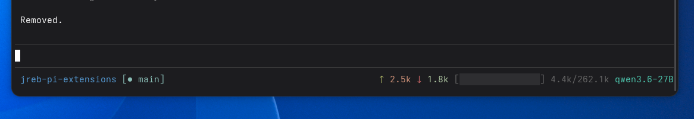

# jreb-pi-extensions

Custom extensions for [pi](https://github.com/earendil-works/pi).

## Extensions

### Custom Footer (`custom-footer.ts`)

Colorful statusline showing token usage, context window progress, git branch, and current model.

**Features:**
- **↑ input / ↓ output** — token counts with colored arrows
- **Context bar** — visual progress bar with color-coded warning levels (green < 70%, yellow 70-90%, red > 90%)
- **● branch** — current git branch
- **model** — active model name



### Herdr Blocked on Question (`herdr-blocked-on-question.ts`)

> **Status: provisional** — a stopgap companion to the Herdr-managed
> `herdr-agent-state.ts`. See *Status & what still needs addressing* below.

Companion extension for [Herdr](https://herdr.dev) users. While pi has an
`ask_user_question` open, it tells Herdr the agent is **blocked** (needs
attention) so hardware readouts — e.g. the
[opendeck-herdr](https://github.com/JohannesBertens/opendeck-herdr) Stream Deck
plugin — turn **red** instead of showing **busy/blue**.

**Important:** it does **not** modify the `ask_user_question` tool. It is a
listener that watches the tool's execution lifecycle (`tool_execution_start` /
`tool_execution_end` for `toolName === "ask_user_question"`) and emits a
`herdr:blocked` event on pi's shared event bus, which the existing
`herdr-agent-state` bridge already maps onto Herdr's `blocked` state. No tool
source is touched.

**Prerequisites:** `herdr integration install pi` must already be installed
(it ships `herdr-agent-state.ts`, which consumes the signal). Inert unless pi is
running under Herdr (`HERDR_ENV=1`).

## Installation

### Option 0: One-liner (install or update from GitHub)

```bash
curl -fsSL https://raw.githubusercontent.com/JohannesBertens/jreb-pi-extensions/main/install.sh | sh
```

Overwrites the extension files in `~/.pi/agent/extensions/`, so re-running it updates to the latest version. Set `PI_EXTENSIONS_DIR` to target a different folder.

### Option 1: Copy to pi extensions folder

```bash
mkdir -p ~/.pi/agent/extensions
cp custom-footer.ts ~/.pi/agent/extensions/
```

In pi, run:
1. `/reload` — pick up the new extension
2. `/footer` — enable the custom footer (toggle off/on with same command)

### Option 2: Symlink from this repo

```bash
mkdir -p ~/.pi/agent/extensions
ln -sf ~/Projects/jreb-pi-extensions/custom-footer.ts ~/.pi/agent/extensions/
```

Changes to the file are picked up automatically with `/reload`.

### Configure context window

If your model's context window isn't detected, add it to `~/.pi/agent/models.json`:

```json
{
  "providers": {
    "your-provider": {
      "models": [
        { "id": "your-model", "contextWindow": 262144 }
      ]
    }
  }
}
```

## Status & what still needs addressing

`herdr-blocked-on-question` is a **provisional** fix for one specific gap:
`ask_user_question` happens mid-turn, so Herdr (correctly) reports `working` and
readouts show "busy". This extension flips that to `blocked` while a question is
open.

Known limitations to address later:

- **Only `ask_user_question` is covered.** Permission / confirmation prompts
  (`ctx.ui.confirm` / `select` / `input`) and the built-in permission gate are
  **not** — they have no single, stable hook yet.
- **Depends on the Herdr-managed bridge.** It emits `herdr:blocked`, consumed by
  `herdr-agent-state.ts`. If Herdr renames or drops that event contract, this
  silently stops working.
- **Proper upstream fix.** The durable solution is for pi core (or the Herdr
  integration) to emit `herdr:blocked` for *all* awaiting-input states, at which
  point this extension becomes redundant.

## License

MIT
